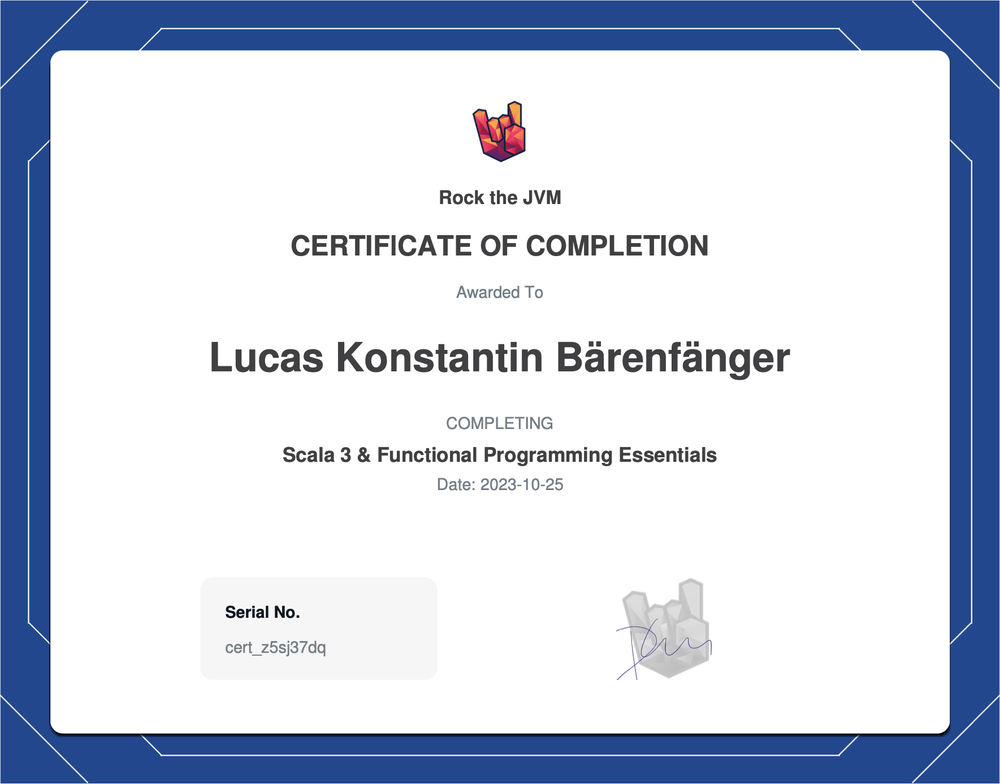

> ### 🚨 My GitHub account name and domain have changed since I created this repository!
> **When I originally created this repository, my GitHub account was `@typeduke` and my domain was `typeduke.com`.
> These might be referenced within this repository.
> Note that my current GitHub account is `@lkbaerenfaenger` and my current domain is `lkbaerenfaenger.com`.**

# rock-the-jvm-scala-3-and-fp-essentials
Me following along Rock the JVM's course [Scala 3 & Functional Programming Essentials](https://rockthejvm.com/courses/enrolled/808121)

